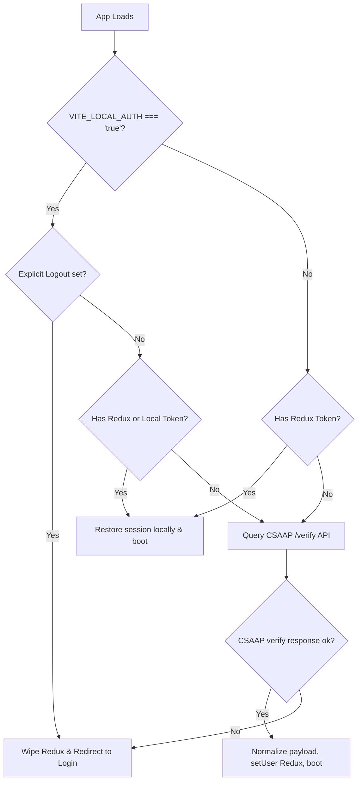

# BuilderERP Authentication & User State Architecture

This document acts as the definitive reference for the BuilderERP authentication flow and user state management. 

It is divided into two sections:
1. **PART 1: How to Use It (Quick Info for Developer)** - Fast reference, code snippets, and instructions for building auth-gated features.
2. **PART 2: The Whole Picture (Architecture & Internals)** - Deep dive into session verification, backend token validations, and sync architectures.

---

## PART 1: How to Use It (Quick Info for Developer)

This section describes how to interact with user details, gate routes/components, check permissions, and run the authentication system locally.

### 1. Consuming User Identity & Session Info
To retrieve the current user's profile, token, or metadata in any React component, import and call the [useAuth.js](file:///d:/Saroj/projects/builder-erp/builder-erp-frontend/src/hooks/useAuth.js) hook.

```javascript
import useAuth from "@/hooks/useAuth";

const UserProfileCard = () => {
  const { 
    user,             // Complete user object
    token,            // Active JWT authentication token
    isAuthenticated,  // boolean state
    role,             // user role e.g., 'admin', 'employee'
    isAdmin,          // boolean convenience flag
    companyId,        // active tenant/company database ID
    companyName,      // company display name
    slug              // tenant subdomain slug
  } = useAuth();

  if (!isAuthenticated) return <p>Please log in.</p>;

  return (
    <div>
      <p>Hello, {user.name} ({user.email})</p>
      <p>Working at company ID: {companyId}</p>
      {isAdmin && <span className="badge">Admin Controls Enabled</span>}
    </div>
  );
};
```

---

### 2. Guarding Elements & Checking Permissions
To check if a user has permission to do or see something, use the [usePermission.js](file:///d:/Saroj/projects/builder-erp/builder-erp-frontend/src/hooks/usePermission.js) hook.

> [!NOTE]
> **Admin Override**: Users with role `admin` or `superadmin`, or who possess the wildcard permission `*`, bypass checks and are automatically granted access.

The hook returns five check functions:

| Function | Checking Logic | Primary Use Case |
| :--- | :--- | :--- |
| **`has(code)`** | Strict prefix matches. Target code must exactly match or be a child of assigned code. | Gating leaf actions (buttons, inputs) like `hrms.employee.add`. |
| **`hasAreaAccess(area)`** | Loose checks. Returns true if assigned code is a child under the requested parent namespace. | Sidebar folders, layout modules. |
| **`hasAccess(code)`** | Combined helper check (`has(code) \|\| hasAreaAccess(code)`). | Top-level route guards and navigation layouts. |
| **`hasAll([...codes])`** | Evaluates true only if **all** codes pass standard `has()` checks. | Pages requiring combined operations. |
| **`hasAny([...codes])`** | Evaluates true if **at least one** code passes standard `has()` checks. | Shared components or cross-functional views. |

#### Implementation Examples:
```javascript
import usePermission from "@/hooks/usePermission";

const EmployeeActionForm = () => {
  const { has, hasAccess, hasAny } = usePermission();

  return (
    <div>
      {/* 1. Module Level Access check */}
      {hasAccess("hrms.employee") && <p>You have access to the employee area.</p>}

      {/* 2. Specific Action Gate check (Strict) */}
      {has("hrms.employee.add") && <button>Add New Employee</button>}
      {has("hrms.employee.delete") && <button className="danger">Terminate Employee</button>}

      {/* 3. Combined/Alternative options check */}
      {hasAny(["hrms.payroll.edit", "hrms.accounting.edit"]) && (
        <button>Adjust Compensation</button>
      )}
    </div>
  );
};
```

---

### 3. Protecting Routes in React Router
To prevent users from navigating to page routes directly by typing the URL, wrap the routes inside [RoutePermissionGuard.jsx](file:///d:/Saroj/projects/builder-erp/builder-erp-frontend/src/components/RoutePermissionGuard.jsx) in your routes file (e.g., [EmployeeRoutes.jsx](file:///d:/Saroj/projects/builder-erp/builder-erp-frontend/src/submodules/hrms/routes/EmployeeRoutes.jsx)).

```javascript
import { Route, Routes } from "react-router-dom";
import RoutePermissionGuard from "@/components/RoutePermissionGuard";
import AttendanceDashboard from "@/pages/AttendanceDashboard";
import PayrollDashboard from "@/pages/PayrollDashboard";

const MyRouter = () => {
  return (
    <Routes>
      {/* Protects a single route subtree: Redirects to '/employee/dashboard' if unauthorized */}
      <Route element={<RoutePermissionGuard permission="hrms.attendance" />}>
        <Route path="attendance" element={<AttendanceDashboard />} />
      </Route>

      {/* Protects a route, overriding the default redirect path */}
      <Route 
        element={
          <RoutePermissionGuard 
            permission="hrms.payroll" 
            redirectTo="/admin/login" 
          />
        }
      >
        <Route path="payroll" element={<PayrollDashboard />} />
      </Route>
    </Routes>
  );
};
```

---

### 4. Gating Sidebar Navigation and Layout Tabs
To construct sidebar items or sub-tabs dynamically based on permission sets:

```javascript
import usePermission from "@/hooks/usePermission";
import { Link } from "react-router-dom";

const Sidebar = () => {
  const { hasAccess } = usePermission();

  const links = [
    { label: "Dashboard", path: "/dashboard", permission: "hrms.dashboard" },
    { label: "Attendance", path: "/attendance", permission: "hrms.attendance" },
    { label: "Payroll", path: "/payroll", permission: "hrms.payroll" },
  ];

  // Filter links dynamically
  const allowedLinks = links.filter((link) => hasAccess(link.permission));

  return (
    <nav>
      {allowedLinks.map((link) => (
        <Link key={link.path} to={link.path}>{link.label}</Link>
      ))}
    </nav>
  );
};
```

---

### 5. Accessing Auth & Token Outside of Components
If you need to retrieve raw authentication values or clear state inside Axios interceptors, helper functions, or vanilla JS files, use the exported functions in [authSession.js](file:///d:/Saroj/projects/builder-erp/builder-erp-frontend/src/store/authSession.js).

```javascript
import { getAuthToken, getAuthCompanyId, resetPersistedAuthState } from "@/store/authSession";
import axios from "axios";

// 1. Appending tokens to API Requests
axios.interceptors.request.use((config) => {
  const token = getAuthToken();
  const companyId = getAuthCompanyId();
  
  if (token) {
    config.headers.Authorization = `Bearer ${token}`;
  }
  if (companyId) {
    config.headers["X-Company-ID"] = companyId;
  }
  return config;
});

// 2. Logging Out / Clearing User States
const handleLogout = async () => {
  try {
    await resetPersistedAuthState(); // Dispatches clearUser, purges Redux and SessionStorage
    window.location.href = "/admin/login";
  } catch (err) {
    console.error("Logout failed:", err);
  }
};
```

---

### 6. Local Development Configuration
Cross-origin cookie checks often fail on `localhost` during development because the browser blocks cookies shared across different domains.

To resolve this locally:
1. Locate the `.env` file in the frontend root `builder-erp-frontend`.
2. Add or update the following line:
   ```env
   VITE_LOCAL_AUTH=true
   ```
3. When `VITE_LOCAL_AUTH` is `true`, the boot sequence trusts and re-hydrates the Redux session stored in `sessionStorage` rather than forcing a round-trip cookie check on CSAAP.

---
---

## PART 2: The Whole Picture (Architecture & Internals)

This section describes how the authentication mechanisms, token structure, and state synchronizations are coordinate-mapped across the ecosystem.

```
┌────────────────────────────────────────────────────────┐
│                   CSAAP SaaS Server                    │
│           (https://csaapnodeapi.csaap.com)             │
└───────────────────────────┬────────────────────────────┘
                            │ (OAuth/SSO Identity Provider)
                            ▼
              ┌───────────────────────────┐
              │  builder-erp-frontend     │
              │  (Redux, useAuth, hooks)  │
              └─────────────┬─────────────┘
                            │
            ┌───────────────┴───────────────┐
            ▼ (Verify Token & Sync Profile) ▼
   ┌──────────────────┐           ┌──────────────────┐
   │   hrms-backend   │           │   crm-backend    │
   │  (MySQL Mirror)  │           │  (MySQL Mirror)  │
   └──────────────────┘           └──────────────────┘
```

### 1. Unified Tenant & Profile Normalization
To prevent naming issues resulting from variable names used by different database tables or versions (e.g., `tenant_id` vs `company_id`, or `slug` vs `subdomain`), the frontend normalizes all incoming authentication payloads inside [userSlice.js](file:///d:/Saroj/projects/builder-erp/builder-erp-frontend/src/store/slices/userSlice.js) via the function `normalizeUserPayload(payload)`.

```javascript
export const normalizeUserPayload = (payload = {}) => ({
  id: payload.id ?? payload.company_id ?? null,
  user_id: payload.user_id ?? payload.id ?? null,
  employee_id: payload.employee_id ?? payload.employeeProfileId ?? null,
  employeeProfileId: payload.employeeProfileId ?? payload.employee_id ?? null,
  name: payload.name || "",
  email: payload.email || "",
  token: payload.token || "",
  csaapToken: payload.csaapToken || payload.token || "",
  companyName: payload.companyName || payload.subdomain || payload.company || payload.slug || "",
  slug: payload.slug || payload.subdomain || payload.company || "",
  role: payload.role || "",
  company_id: payload.company_id ?? payload.tenant_id ?? payload.id ?? null,
  isEmployee: Boolean(payload.isEmployee),
});
```

---

### 2. Session Verification & Auto-Login Boot Sequence
When a user launches the site, [App.jsx](file:///d:/Saroj/projects/builder-erp/builder-erp-frontend/src/App.jsx) attempts to restore the session:



1. **CSAAP Verification Endpoint**:
   The verify check queries:
   `GET https://csaapnodeapi.csaap.com/api/tenant/verify`
2. **Context Setup**:
   Once successful, the client dispatches updates to the Redux store and initializes the React contexts `<UserProvider>` and `<CompanyProvider>`.

---

### 3. Backend Profile Synchronisation
Because the micro-backends (`hrms-backend` and `crm-backend`) run on separate, independent servers and use separate MySQL databases, they must store local references of user data to manage database relationship keys.

When an administrator logs in, the frontend triggers non-blocking POST requests to both backends to synchronize credentials.

#### 1. HRMS Synchronization (`/api/v1/auth/sync`)
The sync request is processed in the HRMS backend inside `syncUser` of [user.controller.js](file:///d:/Saroj/projects/builder-erp/hrms-backend/controllers/user.controller.js):
* Generates a local hashed password derived from:
  `synced:${JWT_SECRET}:${email}:${subdomain}`
* Performs an upsert query to update user attributes:
  ```sql
  INSERT INTO users (id, name, email, password, role, subdomain, api_token)
  VALUES (?, ?, ?, ?, ?, ?, NULL)
  ON DUPLICATE KEY UPDATE
    name      = VALUES(name),
    email     = VALUES(email),
    password  = VALUES(password),
    role      = VALUES(role),
    subdomain = VALUES(subdomain),
    api_token = NULL
  ```

#### 2. CRM Synchronization (`/api/users/sync`)
The sync request is processed in the CRM backend inside `upsertUser` of [user.controller.js](file:///d:/Saroj/projects/builder-erp/crm-backend/controllers/user.controller.js):
* Executes the upsert query via `User.save()` in [user.model.js](file:///d:/Saroj/projects/builder-erp/crm-backend/models/user.model.js):
  ```sql
  INSERT INTO users (id, company_id, company_slug, role, name, email, mobile_number)
  VALUES (?, ?, ?, ?, ?, ?, ?)
  ON DUPLICATE KEY UPDATE
    company_id = VALUES(company_id),
    company_slug = VALUES(company_slug),
    role = VALUES(role),
    name = VALUES(name),
    email = VALUES(email),
    mobile_number = VALUES(mobile_number)
  ```

---

### 4. Backend Authentication Verification Middlewares
Backend security uses middleware structures to parse JWT authentication tokens.

#### HRMS Backend verification
* **`verifyToken.js`**: Parses token values from the headers, request body, or query strings. It runs `jwt.verify(token, process.env.JWT_SECRET)` and attaches the output payload to `req.user`. If verify fails, it halts request execution returning a `401 Unauthorized` JSON block.
* **`tokenData.js`**: Runs a non-blocking token parse (`parseTokenData`). If a token exists, it decodes and appends the details to `req.tokenData` but continues execution to the next controller whether the verification succeeded or not (useful for optional authentication endpoints).

#### CRM Backend verification
* **`authMiddleware.js`**: Exposes the `protect` function which verifies tokens using `config.auth.tokenSecret` and populates `req.user`.
* **CRM Middleware Guards**:
  * `restrictTo(...roles)`: Throws a `403 Forbidden` if the user's role does not match the parameters.
  * `requireOwnerOrAdmin`: Verifies if the parameter ID (`req.params.id`) matches the authenticated user's ID (`req.user.id`) or if the user's role is `admin`.
